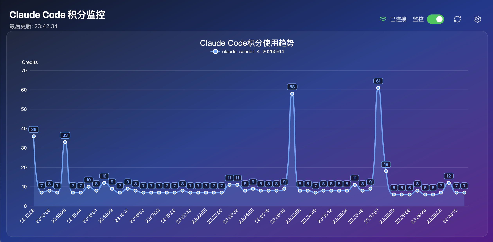

# Claude Code 积分监控系统 (CCCMU)

一个用于实时监控和可视化 Claude Code 积分使用量的 Web 应用程序。

## 📸 项目截图



*实时监控 Claude Code 积分使用量，支持多时间范围查看和趋势分析*

## 🚀 功能特性

- **实时监控**: 通过 SSE (Server-Sent Events) 实时展示积分使用量变化曲线
- **可视化图表**: 使用 ECharts 生成美观的折线图展示积分使用趋势
- **多时间范围**: 支持查看最近 1小时、2小时、3小时、6小时、12小时、24小时的使用情况
- **多模型对比**: 支持同时展示不同 Claude 模型的积分使用情况
- **配置管理**: 支持自定义数据获取间隔和 Cookie 配置
- **单文件部署**: 前端静态文件内嵌到后端二进制文件中，部署简单

## 🏗️ 技术架构

### 前端技术栈
- **Bun** - 现代 JavaScript 运行时和包管理器
- **Vite** - 现代前端构建工具
- **React 19** + **TypeScript** - UI 框架
- **TailwindCSS 4** - 原子化 CSS 框架
- **ECharts** - 数据可视化图表库
- **Lucide React** - 现代图标库

### 后端技术栈
- **Go 1.23** - 后端编程语言
- **Fiber v2** - 高性能 Web 框架
- **BadgerDB** - 嵌入式 NoSQL 数据库
- **Resty** - HTTP 客户端库
- **Gocron** - 定时任务调度器
- **Go Embed** - 静态文件嵌入

## 📦 项目结构

```
cccmu/
├── server/                 # 后端代码
│   ├── client/            # API 客户端
│   ├── database/          # 数据库操作
│   ├── handlers/          # HTTP 处理器
│   ├── models/            # 数据模型
│   ├── services/          # 业务服务
│   ├── web/               # 静态文件嵌入
│   └── main.go           # 程序入口
├── web/                   # 前端代码
│   ├── src/
│   │   ├── components/   # React 组件
│   │   ├── pages/        # 页面组件
│   │   ├── api/          # API 客户端
│   │   └── types/        # TypeScript 类型定义
│   ├── dist/             # 前端构建输出
│   └── package.json
├── docs/                  # 项目文档
├── Makefile              # 构建脚本
└── README.md
```

## 🔧 快速开始

### 环境要求

- **Go**: >= 1.23
- **Bun**: >= 1.0
- **Node.js**: >= 18 (可选，Bun 可替代)

### 安装依赖

```bash
# 安装项目依赖
make install
```

### 开发模式

```bash
# 启动前端开发服务器
make dev-frontend

# 启动后端开发服务器
make dev-backend

# 同时启动前后端开发环境
make dev
```

### 生产构建

```bash
# 完整构建项目
make build
```

构建完成后会生成 `cccmu` 可执行文件，包含完整的前后端应用。

### 运行应用

```bash
# 运行构建好的二进制文件
./cccmu
```

默认访问地址: http://localhost:8080

## ⚙️ 配置说明

### Cookie 配置

1. 访问 [Claude Code Dashboard](https://www.aicodemirror.com/dashboard/usage)
2. 在浏览器开发者工具中复制完整的 Cookie 字符串
3. 在应用设置页面中粘贴 Cookie 信息

### 数据获取间隔

支持配置以下时间间隔：
- 1 分钟（默认）
- 5 分钟
- 10 分钟
- 30 分钟
- 1 小时

### 数据展示范围

支持以下时间范围：
- 最近 1 小时（默认）
- 最近 2 小时
- 最近 3 小时
- 最近 6 小时
- 最近 12 小时
- 最近 24 小时

## 🔌 API 接口

### 数据接口

- **积分查询**: `https://www.aicodemirror.com/api/user/usage`
- **Cookie 验证**: `https://www.aicodemirror.com/api/user/usage/chart`

### SSE 连接

前端通过以下端点建立 SSE 连接接收实时数据：
- **连接地址**: `/api/sse`
- **事件类型**: `usage` - 积分使用数据

## 🛠️ 开发命令

```bash
# 查看所有可用命令
make help

# 代码格式化
make fmt

# 代码检查
make lint

# 运行测试
make test

# 清理构建文件
make clean
```

## 📊 数据格式

积分使用数据结构：
```json
{
  "id": 11048661,
  "type": "USAGE",
  "endpoint": "v1/messages",
  "statusCode": 200,
  "creditsUsed": 9,
  "createdAt": "2025-08-25T13:39:44.230Z",
  "model": "claude-sonnet-4-20250514"
}
```

## 🔐 安全说明

- Cookie 信息本地存储在 BadgerDB 中
- 定期验证 Cookie 有效性
- 无效 Cookie 会自动停止数据获取并提示用户更新

## 📝 许可证

本项目采用 MIT 许可证 - 查看 [LICENSE](LICENSE) 文件了解详情。

## 🤝 贡献指南

1. Fork 本项目
2. 创建特性分支 (`git checkout -b feature/AmazingFeature`)
3. 提交更改 (`git commit -m 'Add some AmazingFeature'`)
4. 推送到分支 (`git push origin feature/AmazingFeature`)
5. 开启 Pull Request

## 📞 支持

如果您遇到任何问题或有功能建议，请在 [GitHub Issues](https://github.com/leafney/cccmu/issues) 中提出。