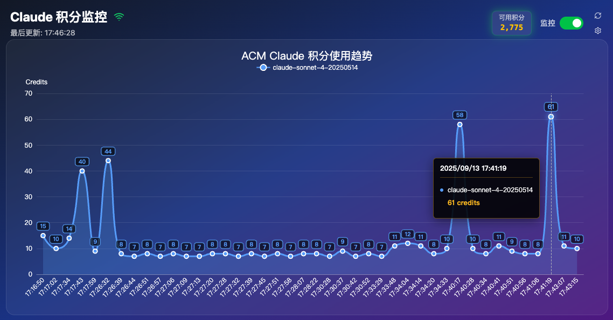

# ACM Claude 积分监控系统 (CCCMU)

一个用于实时监控和可视化 ACM Claude 积分使用量的 Web 应用程序。

## 📸 项目截图



*实时监控 ACM Claude 积分使用量，支持多时间范围查看和趋势分析*

## 🚀 功能特性

- **实时监控**: 通过 SSE (Server-Sent Events) 实时展示积分使用量变化曲线
- **积分余额显示**: 实时展示当前剩余积分数量，支持自动刷新
- **积分重置功能**: 支持手动重置每日积分和自动定时重置
- **用户身份认证**: 基于访问密钥的身份验证系统，保护数据安全
- **自动重置调度**: 支持配置定时自动重置积分，避免手动操作
- **可视化图表**: 使用 ECharts 生成美观的折线图展示积分使用趋势
- **多时间范围**: 支持查看最近 1小时、2小时、3小时、6小时、12小时、24小时的使用情况
- **多模型对比**: 支持同时展示不同 Claude 模型的积分使用情况
- **智能Cookie验证**: 通过数据获取接口隐式验证，无需额外验证请求
- **配置管理**: 支持自定义数据获取间隔和Cookie配置
- **单文件部署**: 前端静态文件内嵌到后端二进制文件中，部署简单

## 🖥️ 界面操作说明

### 主界面组件

**顶部控制栏**：
- **🟢/🔴 SSE连接状态图标**：显示实时数据连接状态
  - **绿色**：已连接，正常接收实时数据
  - **红色**：连接断开，无法接收实时数据
- **🔄 刷新图标**：立即获取最新积分趋势数据和剩余积分余额
- **▶️ 监控开关**：启动/停止实时数据监控，控制定时数据获取
- **🔁 重置开关**：启用自动重置，支持配置多种自动重置的触发条件
- **⚙️ 设置图标**：打开配置面板，管理Cookie、监控间隔和自动重置等设置

**积分余额区域**：
- **剩余积分数字**：显示当前可用积分数量，实时更新，点击后执行手动重置当日积分操作
- **更新时间戳**：最后一次数据更新的时间
- **状态指示器**：通过光晕颜色显示重置状态
  - **绿色光晕**：当日未重置，可执行手动重置
  - **紫色光晕**：当日未重置，已启用自动重置
  - **红色光晕**：当日已重置

**图表控制面板**：
- **时间范围选择器**：选择数据展示时间范围（1小时、2小时、3小时、6小时、12小时、24小时）
- **模型筛选开关**：选择要显示的Claude模型类型（支持多模型同时显示）
- **图表缩放控制**：鼠标滚轮缩放，拖拽平移查看详细数据

**趋势图表区域**：
- **折线图**：实时展示积分使用趋势，不同颜色代表不同模型
- **数据点提示**：鼠标悬停显示具体时间点的积分使用量
- **时间轴**：自动调整时间刻度，便于查看数据变化

### 设置面板操作

**基础配置**：
- **Cookie设置**：粘贴从ACM Claude Dashboard获取的完整Cookie字符串
- **监控间隔**：选择数据获取频率（30秒-1小时可选）
- **Cookie验证**：自动验证Cookie有效性，失效时会提示更新

**自动重置配置**：
- **启用开关**：开启/关闭自动重置功能
- **时间设置**：配置每日自动重置的具体时间（HH:MM格式）
- **状态显示**：显示自动重置功能的当前状态和下次执行时间

**身份认证**：
- **访问密钥**：首次访问时输入启动时生成的访问密钥
- **会话状态**：显示当前登录状态和剩余有效时间
- **登出功能**：手动清除会话，重新要求身份验证

## 🏗️ 技术架构

### 前端技术栈
- **Bun** - 现代 JavaScript 运行时和包管理器
- **Vite** - 现代前端构建工具
- **React 19** + **TypeScript** - UI 框架
- **TailwindCSS 4** - 原子化 CSS 框架
- **ECharts** - 数据可视化图表库
- **Lucide React** - 现代图标库

### 后端技术栈
- **Go 1.23** - 后端编程语言
- **Fiber v2** - 高性能 Web 框架
- **BadgerDB** - 嵌入式 NoSQL 数据库
- **Resty** - HTTP 客户端库
- **Gocron** - 定时任务调度器
- **Go Embed** - 静态文件嵌入

## 📦 项目结构

```
cccmu/
├── server/                 # 后端代码
│   ├── client/            # API 客户端
│   ├── database/          # 数据库操作
│   ├── handlers/          # HTTP 处理器
│   ├── models/            # 数据模型
│   ├── services/          # 业务服务
│   ├── web/               # 静态文件嵌入
│   └── main.go           # 程序入口
├── web/                   # 前端代码
│   ├── src/
│   │   ├── components/   # React 组件
│   │   ├── pages/        # 页面组件
│   │   ├── api/          # API 客户端
│   │   └── types/        # TypeScript 类型定义
│   ├── dist/             # 前端构建输出
│   └── package.json
├── docs/                  # 项目文档
├── Makefile              # 构建脚本
└── README.md
```

## 🚀 快速部署

### 使用 Docker (推荐)

```bash
# 拉取最新镜像
docker pull ghcr.io/leafney/cccmu:latest

# 运行容器
docker run -d \
  --name cccmu \
  -p 8080:8080 \
  -v $(pwd)/data:/app/.b \
  ghcr.io/leafney/cccmu:latest

# 或使用 Docker Compose
docker-compose up -d
```

访问 http://localhost:8080 开始使用。

### 使用二进制文件

从 [Releases](https://github.com/leafney/cccmu/releases) 页面下载对应平台的二进制文件：

```bash
# Linux/macOS
chmod +x cccmu-linux-amd64
./cccmu-linux-amd64

# Windows
cccmu-windows-amd64.exe
```

### 支持的平台

- **Docker**: `linux/amd64`, `linux/arm64`
- **二进制文件**: Windows (amd64), macOS (amd64, arm64), Linux (amd64, arm64)

📖 **详细部署指南**: 查看 [DEPLOY.md](DEPLOY.md) 了解完整的部署选项、配置参数和高级用法。

## 🔧 开发环境

### 环境要求

- **Go**: >= 1.23
- **Bun**: >= 1.0
- **Node.js**: >= 18 (可选，Bun 可替代)

### 安装依赖

```bash
# 安装项目依赖
make install
```

### 开发模式

```bash
# 启动前端开发服务器
make dev-frontend

# 启动后端开发服务器
make dev-backend

# 同时启动前后端开发环境
make dev
```

### 生产构建

```bash
# 完整构建项目
make build
```

构建完成后会生成 `cccmu` 可执行文件，包含完整的前后端应用。

### 本地运行

```bash
# 使用默认端口 8080 运行
./cccmu

# 使用自定义端口运行
./cccmu -p 9090

# 启用详细日志输出（用于调试）
./cccmu -l

# 同时指定端口和启用日志
./cccmu -p 9090 -l

# 设置Session过期时间为24小时
./cccmu -e 24

# 设置Session过期时间为48小时（支持时间单位）
./cccmu -e 48h

# 查看帮助信息
./cccmu -h

# 查看版本信息
./cccmu -v
```

默认访问地址: `http://localhost:8080`

#### 命令行参数

| 参数 | 缩写 | 描述 | 示例 |
|------|------|------|------|
| `--port` | `-p` | 指定服务器端口号 | `./cccmu -p 9090` 或 `./cccmu --port 9090` |
| `--log` | `-l` | 启用详细日志输出（用于调试和维护） | `./cccmu -l` 或 `./cccmu --log` |
| `--expire` | `-e` | 设置Session过期时间（默认168小时=7天） | `./cccmu -e 24` 或 `./cccmu -e 48h` |
| `--version` | `-v` | 显示版本信息并退出 | `./cccmu -v` 或 `./cccmu --version` |
| `--help` | `-h` | 显示帮助信息 | `./cccmu -h` 或 `./cccmu --help` |

**日志控制说明：**
- **默认模式**：静默运行，仅显示必要的启动和错误信息
- **调试模式**：使用 `-l` 或 `--log` 参数启用详细日志，包括：
  - API 请求和响应详情
  - 积分计算过程
  - 数据处理状态
  - 定时任务执行情况
- **性能影响**：未启用日志时，调试输出被完全禁用，不影响运行性能

**Session过期时间说明：**
- **默认设置**：168小时（7天）
- **数值格式**：支持纯数字（按小时计算）或带时间单位的格式
- **支持单位**：
  - `h` - 小时（如 `24h`）
  - `m` - 分钟（如 `30m`）
  - `s` - 秒（如 `3600s`）
- **应用范围**：控制用户身份认证的会话有效期，到期后需重新登录
- **安全考虑**：较短的过期时间提高安全性，较长的过期时间提高使用便利性

#### 端口配置方式

支持多种端口配置方式，按优先级排序：

1. **命令行参数**（最高优先级）
   ```bash
   ./cccmu -port 9090
   ./cccmu -port :3000
   ```

2. **环境变量**
   ```bash
   PORT=9090 ./cccmu
   export PORT=3000 && ./cccmu
   ```

3. **默认端口**：`:8080`（如果未配置其他方式）

命令行参数会覆盖环境变量设置：
```bash
# 最终使用端口 9090（命令行参数优先）
PORT=8080 ./cccmu -p 9090
```

#### 版本信息显示

使用 `-v` 参数可以查看应用的详细版本信息：

```bash
./cccmu -v
```

输出示例：
```
Version:   v1.0.0
GitCommit: c3726fb  
BuildTime: 2025-09-12 15:30:45
GoVersion: go1.23.1
```

**版本信息说明：**
- **Version**: 应用版本号（Git标签或commit短哈希）
- **GitCommit**: Git提交的短哈希值
- **BuildTime**: 构建时间（本地时间）
- **GoVersion**: 编译时使用的Go语言版本

## 🔐 身份认证

### 访问密钥验证

应用启动时会自动生成访问密钥，用于保护数据安全：

```bash
🔑 当前访问密钥: 1b0fd7cfeaff7bce7990152d99512c92
⏰ Session过期时间: 168h0m0s
```

**访问方式**：
- 首次访问需要输入访问密钥进行身份验证
- 验证成功后会保存会话状态，默认有效期 7 天
- 访问密钥在应用启动时生成，重启应用会生成新密钥

**安全特性**：
- 基于 Session 的身份验证机制
- 自动密钥轮换（应用重启时）
- 可配置的会话过期时间
- 本地数据库存储，确保数据隐私

## ⏰ 自动重置功能

### 定时重置配置

支持配置自动重置积分的时间，避免手动操作：

**配置选项**：
- **启用状态**：开启/关闭自动重置功能
- **重置时间**：设置每日重置的具体时间（如 18:30）
- **防重复执行**：同一天内只执行一次重置操作

**使用说明**：
1. 在设置面板中启用"自动重置"功能
2. 设置重置时间（格式：HH:MM，如 18:30）
3. 保存配置后，系统会在指定时间自动执行重置

**技术实现**：
- 基于 Cron 表达式的定时任务调度
- 智能防重复执行机制
- 复用现有重置 API，确保功能一致性
- 独立的调度服务，不影响监控功能

## ⚙️ 配置说明

### Cookie 配置

1. 访问 [ACM Claude Dashboard](https://www.aicodemirror.com/dashboard/usage)
2. 在浏览器开发者工具中复制完整的 Cookie 字符串
3. 在应用设置页面中粘贴 Cookie 信息

### 数据获取间隔

支持配置以下时间间隔：
- 30 秒
- 1 分钟（默认）
- 5 分钟
- 10 分钟
- 30 分钟
- 1 小时

### Cookie验证机制

**智能隐式验证**：
- 通过积分数据获取和余额查询接口自动验证Cookie有效性
- 当API返回401状态码时自动检测Cookie失效
- 验证失败时会通过前端提示用户更新Cookie
- 无需额外的验证请求，减少API调用频次

### 数据展示范围

支持以下时间范围：
- 最近 1 小时（默认）
- 最近 2 小时
- 最近 3 小时
- 最近 6 小时
- 最近 12 小时
- 最近 24 小时

## 📊 数据格式

### 积分使用数据结构

```json
{
  "id": 11048661,
  "type": "USAGE", 
  "endpoint": "v1/messages",
  "statusCode": 200,
  "creditsUsed": 9,
  "createdAt": "2025-08-25T13:39:44.230Z",
  "model": "claude-sonnet-4-20250514"
}
```

### 积分余额数据结构

```json
{
  "remaining": 7542,
  "updatedAt": "2025-09-01T10:30:45.123Z"
}
```

## 🔐 安全说明

### 数据安全
- Cookie 信息本地存储在 BadgerDB 中，确保数据安全
- **隐式Cookie验证**：通过数据获取接口自动验证Cookie有效性，减少API调用
- **自动失败处理**：Cookie失效时前端会提示用户更新，保护系统稳定性
- **智能错误处理**：401状态码自动识别Cookie过期，及时反馈给用户

### 身份认证安全
- **访问密钥保护**：所有数据访问都需要有效的访问密钥
- **Session管理**：基于会话的身份验证，支持自动过期和清理
- **本地存储**：所有敏感数据仅存储在本地，不传输到外部服务器
- **密钥轮换**：应用重启时自动生成新的访问密钥，提高安全性

### 自动重置安全
- **防重复执行**：智能检测当日是否已执行重置，避免重复操作
- **独立调度**：自动重置功能独立运行，不影响其他系统功能
- **错误恢复**：重置失败时会记录日志，不影响系统稳定性

## 📝 许可证

本项目采用 MIT 许可证 - 查看 [LICENSE](LICENSE) 文件了解详情。

## 🤝 贡献指南

1. Fork 本项目
2. 创建特性分支 (`git checkout -b feature/AmazingFeature`)
3. 提交更改 (`git commit -m 'Add some AmazingFeature'`)
4. 推送到分支 (`git push origin feature/AmazingFeature`)
5. 开启 Pull Request

## 📞 支持

如果您遇到任何问题或有功能建议，请在 [GitHub Issues](https://github.com/leafney/cccmu/issues) 中提出。
